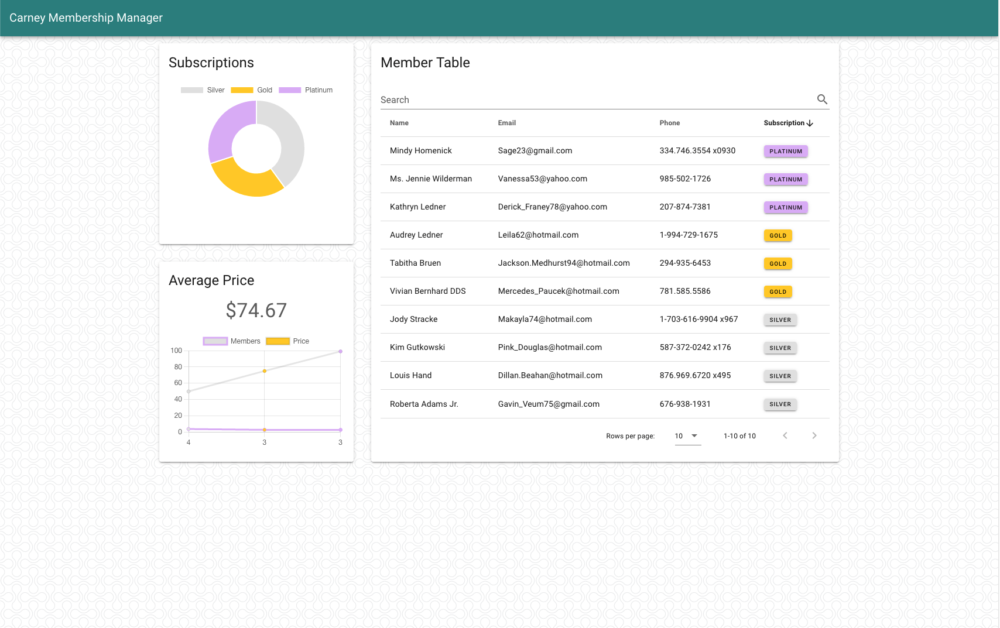

# Carney Membership Tool

## Overview

This app retrieves Member and Subscription data from a backend service and displays a sortable datatable, along with two graphs. Notice the subscription badges are clickable and will open a temporary side drawer revealing details for each plan.

## Screenshot

## How to Install and Run

1. Go to root dir and execute `npm install --legacy-peer-deps`
2. Execute `npm run migrate` to migrate your development database
3. Execute `npm run seed` to seed your development database
4. Execute `npm start`
5. Create new terminal instance and navigate to `/client` and execute `yarn install`
6. Execute `yarn serve`
7. Open browser to client server.

## My Process

- Follow spec sheet.
- Read through existing code base.
- Consider whether to map data on API call, or client side.
- Decided on call. Ended up writing the DTOs in a way that made sense to me.
- Add client folder and frontend framework.
- Create API layer
- Create app-level notifications
- Create UI components
- Keep logic in one place ( app layer ) In a traditional app I would have probably taken time to use Vuex or create some kind of composables to take care of the logic and keep components view-based.
- Style components
- Write tests

### Issues

- Faker threw a tantrum because of the way we were digging into it. I could have finessed it, but just made it work by digging in directly with the pre-existing code ( i.e. `faker.faker.name.findName()` ).
- NPM threw a tantrum about unsafe code, so the docs need to be updated to add the `--legacy-peer-deps` flag when installing.
- ChartJS is a bit finicky with responsiveness ( a known issue with canvas elements). I was able to hook into a breakpoint service and apply dynamic styles to the container to help.

### Frameworks and Libraries

#### Added

- Vue 2 ( Vue 3 is not supported by Vuetify at this time )
- Vuetify
- ChartJS
- Dart Sass

#### Existing

- Express
- Bookshelf
- Mocha

### What was Enjoyable?

Since I am currently a full-time Frontend Developer for B2B apps, I very much miss being able to write my own DTOs! I had a lot of fun thinking through how to map data on the backend.

As always, I also enjoyed thinking how I client might like to experience this application and did my best to make it function well, look great, and be flexible for different devices.

I would have liked to have encapsulate some of the logic and DRY things up ( like with the chart component and side panel ), but for time's sake, I could not.

---

# Code Test: Node ( Original Readme )

A simple Express app designed to provide a basic API for our code test.

### Requirements

- [Node](https://github.com/nvm-sh/nvm) (10+) or an environment like Docker (see below)

### Setup

1. Run `npm install` to install dependencies (skip this step if using Docker)

2. Run `npm run migrate` to migrate your development database

3. Run `npm run seed` to seed your development database

4. Run `npm start` to start up the local development server (skip this step if using Docker)

You should get JSON output from <http://localhost:3000/members>

### Testing

Run `npm test` to run the test suite.

### Docker

As an alternative to installing node directly, you can use the provided Docker files to run the app and test suite.

Run `docker-compose up -d` to start the Docker container, then run the [Setup tasks](#setup) above, prepending `docker-compose exec web` to the command (e.g. `docker-compose exec web npm run migrate`)

> Changes to the app code may require restarts to the node process. To do so, run `docker-compose restart`
